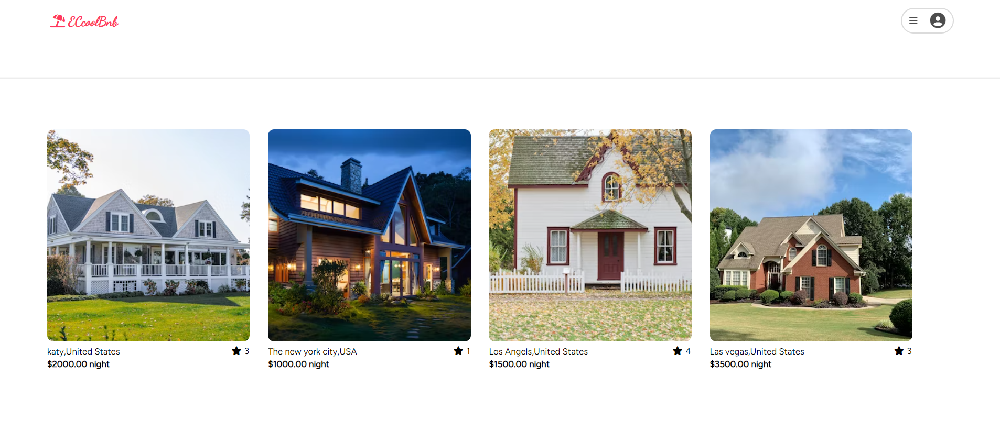

# EccoolBnb project

>“Travel is the only thing you buy that makes you richer.”

## About EccoolBnb

[EccoolBnb](https://eccoolbnb.onrender.com) is a website clone of Airbnb. EccoolBnb is designed for sharing spare homes for others who need lodging. EccoolBnb provides the flexibility for travelers who can book, and explore homes though the site, as well as leaving reviews and ratings.  The website also provides the sharing feature for users who are willing to rent their properties. 

## EccoolBnb wiki documents

* [Frontend-Store-Shape](https://github.com/no8cai/EccoolBnb/wiki/Frontend-Store-Shape)
* [Database Schema Design](https://github.com/no8cai/EccoolBnb/wiki/Database-Schema-Design)
* [Backend API Documentation](https://github.com/no8cai/EccoolBnb/wiki/Backend-Documentation)
* [Feature List](https://github.com/no8cai/EccoolBnb/wiki/Eccoolbnb-Features-List)

## The technologies invoved

#### General coding:
* JavaScript

#### Backend:
* Sequelize
* Express

#### Frontend:
* React
* Redux
* HTML
* CSS

#### Database:
* Sqlite3(Development)
* PostgreSQL(Production)

#### Website provider:
* Render

## Usage descriptions of features

Welcome to explore the site and test feature by using "Demo User" by clicking the login selection. 
* [EccoolBnb live link on render](https://eccoolbnb.onrender.com) 

### Landing page

For more usage image guild please click [here](https://github.com/no8cai/EccoolBnb/wiki/Usage-descriptions-of-features)

## Roadmap

### Completed Fetures
[x] The User Authentication
[x] Properties listing
[x] Reviews and rating

### future features
[] Review images add-on
[] Booking
[] Google map link
[] Messaging

## Getting Started
This is an instructions on setting up the project locally. To get a local copy up and running follow these simple example steps.

### Installation

1. Clone the repor
> https://github.com/no8cai/EccoolBnb.git

2. Populate the .env file based on the example below:
> PORT=8000
> DB_FILE=db/dev.db
> JWT_SECRET=«generate_strong_secret_here»
> JWT_EXPIRES_IN=604800
> SCHEMA=«custom_schema_name_here»
Please make your own good JWT secret key and schema name

3. Install NPM packages on both /fronted and /backend directory
>npm install

4. Migrate and Seed the data
> npx dotenv sequelize db:migrate
> npx dotenv sequelize db:seed:all

5. Run the NPM development command to start both frontend server and backend server
> npm start

## Contact information

ERIC CHAI -no8cai@gmail.com

